  
  

<h1 align="left">Hi, I'm polylvst</h1>

Creating bugs since 2021. I work mostly with Android (Jetpack Compose) and FastAPI on the backend. I enjoy building things that actually work, and fixing them when they don't.  - 🔭 Current focus: Android apps with a FastAPI backend - 🌱 Learning: Kotlin architecture patterns, system design, and low-key trying to not overengineer everything - ⚡ I like automating boring stuff and finding ways to make tools work harder so I don't have to  
> "No scientist would call themselves one if they are afraid to make mistakes." 
> — Okabe Rintarou

<i>El Psy Kongroo</i>

  

  
  
  
  
  
  
  

  
  
  
  
  
  
  
  
  
  
  
  
  
  
  
  
  
  
  
  
  
  

So I've got this TrueNAS box at home running around 20 containers: photos, movies, bookmarks, a bunch of little tools, all on my own domain. Problem is my ISP doesn't give me a public IP and throttles UDP, so I rent a cheap VPS in California and tunnel everything back home through it. Kinda overkill, but it works, and I learned a ton breaking it.

<picture>
  <source media="(prefers-color-scheme: dark)" srcset="https://raw.githubusercontent.com/PolyLvst/PolyLvst/main/assets/homelab-route.svg">
  <source media="(prefers-color-scheme: light)" srcset="https://raw.githubusercontent.com/PolyLvst/PolyLvst/main/assets/homelab-route-light.svg">
  
</picture>

  
  
  
  
  <picture>
    <source media="(prefers-color-scheme: dark)" srcset="https://cdn.jsdelivr.net/gh/selfhst/icons/svg/amd-light.svg">
    
  </picture>
  
  
  
  
  
  
  <picture>
    <source media="(prefers-color-scheme: dark)" srcset="https://cdn.jsdelivr.net/gh/selfhst/icons/svg/karakeep-light.svg">
    
  </picture>
  
  
  
  
  
  
  
  
  
  
  
  
  
  

Lab notes

 

- I tried WireGuard and Tailscale first, but my ISP throttles UDP so the connection kept dying. Now the home server just dials out to the VPS with wstunnel over TCP/443, and the ISP doesn't touch that.
- The VPS opens up the traffic so CrowdSec and GeoBlock can kick out the bad stuff, then encrypts it again on the way home. Only my own client cert can open the tunnel, and the wildcard certs come from Cloudflare. The VPS config is public if you're curious: [traefik-home-vps](https://github.com/PolyLvst/traefik-home-vps).
- The scary stuff (the TrueNAS UI, AdGuard, the proxy dashboards) only works from inside my house. The gateway turns those requests away before they get anywhere near the tunnel.
- Tinyauth sits in front of everything so I only log in once. Uptime Kuma yells at me when something's down, Scrutiny keeps an eye on the disks before they die on me, and Dockge is how I poke at the Compose stacks.
- There's an RX 6600 in there running a local LLM that auto-tags my Karakeep bookmarks. AMD doesn't officially support that card on ROCm, so getting it working took some convincing. I also wrote a little script that re-tags whatever it messes up.

<picture>
  <source media="(prefers-color-scheme: dark)" srcset="https://raw.githubusercontent.com/PolyLvst/PolyLvst/output/pacman-contribution-graph-dark.svg">
  <source media="(prefers-color-scheme: light)" srcset="https://raw.githubusercontent.com/PolyLvst/PolyLvst/output/pacman-contribution-graph.svg">
  
</picture>

  

  
  

